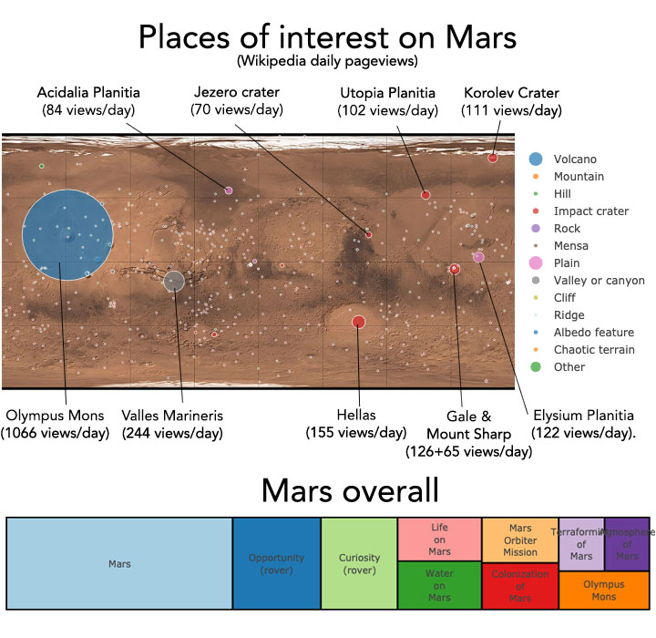
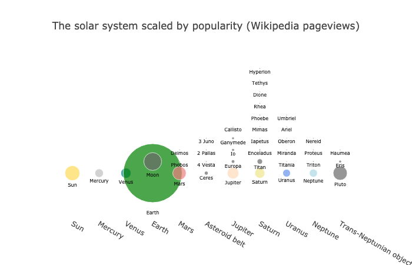

# Wikipedia_Mars

HTML version of the Jupyter notebook: [http://users.ox.ac.uk/~bioc1451/Mars.html](http://users.ox.ac.uk/~bioc1451/Mars.html).

Wikipedia pageviews daily average across a year.
Places obtained by scraping the category `Category:Geography_of_Mars` and parsing the templates `infobox feature on celestial object` and `infobox crater data`, using the class `WikicatParser`.

The data was further polished to extract x, y style coordinates from the `coord` template within these using the method `parse_coords`.

For notes on wikiparsing see [https://blog.matteoferla.com/2019/07/wikipedia-datamining.html](https://blog.matteoferla.com/2019/07/wikipedia-datamining.html).

The reason why this came about was because of my previous graph of the planets, which shows Pluto as more popular than Mars.

## See also

 * [Wikipedia_planes](https://github.com/matteoferla/Wikipedia_planes)

